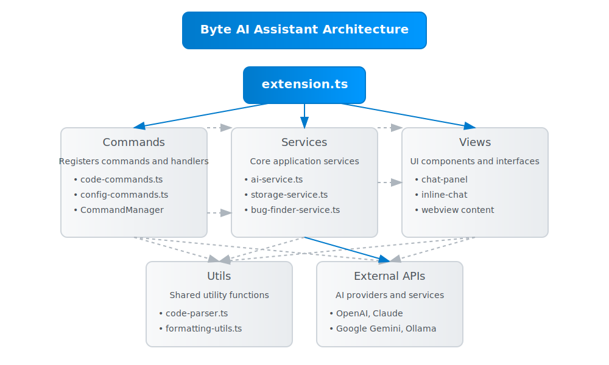

# Byte AI Assistant

A powerful AI-powered coding assistant for VS Code that helps developers write, analyze, refactor, and optimize code.

<div align="center">
  
</div>

<div align="center">
  <h2>Architecture Overview</h2>
  
</div>

## ✨ Features

- 🤖 **AI Chat**: Interact with AI models directly in VS Code
- 🔍 **Code Analysis**: Get detailed explanations and insights about your code
- 🛠️ **Code Refactoring**: Improve your code with AI-powered suggestions
- 📝 **Documentation Generation**: Create comprehensive documentation for your codebase
- 🧪 **Test Generation**: Automatically generate unit tests for your code
- 🚀 **Performance Optimization**: Receive suggestions to optimize and improve performance
- 📊 **Code Issue Detection**: Find potential bugs, vulnerabilities, and code smells
- 🐛 **Bug Finder**: Automatically detect and fix terminal errors with AI
  - Monitors terminal output for error messages in real-time
  - Provides AI-powered error analysis and solutions
  - Allows one-click application of suggested fixes
  - Includes permanent status bar indicator for monitoring status

## 🧠 Supported AI Providers

Byte supports multiple AI providers to fit your preference and needs:

- **OpenAI** (GPT-3.5-Turbo, GPT-4, GPT-4-Turbo)
- **Google Gemini** (Gemini 1.5 Flash, Gemini 1.5 Pro)
- **Anthropic Claude** (Claude 3 Opus, Claude 3 Sonnet, Claude 3 Haiku)
- **Local models** (via Ollama - supports Llama3, CodeLlama, Mistral, Mixtral, Neural-Chat, Phi)

## 🛠️ Installation

### VS Code Marketplace

1. Open VS Code
2. Go to Extensions (Ctrl+Shift+X or Cmd+Shift+X)
3. Search for "Byte AI Assistant"
4. Click Install

### Manual Installation

Download the `.vsix` file from the [releases page](https://github.com/tuncer-byte/byte/releases) and install it using:

```bash
code --install-extension byte-0.1.1.vsix
```

### From Source

```bash
# Clone the repository
git clone https://github.com/tuncer-byte/byte.git

# Navigate to the directory
cd byte

# Install dependencies
npm install

# Build and package the extension
npm run vscode:prepublish

# Install the extension from the local .vsix file
code --install-extension byte-0.1.1.vsix
```

## 🚀 Getting Started

1. **Install the extension** from the VS Code marketplace or using the manual method above
2. **Open the Byte panel** by clicking the Byte icon in the activity bar
3. **Configure your AI provider** using the `/configure` command in the chat panel 
   - You'll need an API key for most providers (OpenAI, Anthropic, Google)
   - For local models, ensure Ollama is running with your preferred model
4. **Start using the features** via:
   - Chat panel in the sidebar
   - Right-click context menu on selected code
   - Command palette (Ctrl+Shift+P or Cmd+Shift+P)
   - Keyboard shortcuts

## 💡 Key Features

### AI Chat

Use the chat panel to have conversations with the AI. You can:
- Ask general coding questions
- Request code examples
- Discuss software architecture
- Use slash commands for specialized tasks

### Code Analysis

Select any code in your editor and use "Analyze Selected Code" to get:
- Line-by-line explanation of how the code works
- Potential issues and improvement suggestions
- Best practices recommendations
- Time and space complexity analysis

### Bug Finder

The Bug Finder feature automatically monitors your terminal for errors and provides AI-powered solutions.

#### How to use Bug Finder

1. **Start Error Monitoring**
   - Use the command palette (`Ctrl+Shift+P` or `Cmd+Shift+P`)
   - Select "Byte: Start Terminal Error Monitoring"
   - A notification will appear, and a status bar indicator will show monitoring is active

2. **Automatic Error Detection**
   - When an error occurs in the terminal, it's automatically detected
   - You'll receive a notification with the option to analyze the error with AI
   - Click "Analyze Error with AI" to get a solution

3. **Manual Error Analysis**
   - Use the command "Byte: Analyze Error Message" to manually analyze errors
   - Paste the error message when prompted
   - The AI will analyze the error and suggest solutions

4. **Solution Panel**
   - The AI solution is displayed in a panel showing:
     - Root cause of the error
     - Technical explanation
     - Step-by-step solution
     - Preventive measures for the future
   - You can apply suggested commands or code changes directly from the panel

5. **Stop Monitoring**
   - Use the command "Byte: Stop Terminal Error Monitoring" to stop
   - Or click on the status bar indicator to turn it off

## ⌨️ Commands and Shortcuts

### Main Commands

| Command | Description |
|---------|-------------|
| `Byte: Open AI Chat` | Open the main chat panel |
| `Byte: Explain Selected Code` | Get an explanation of the selected code |
| `Byte: Refactor Selected Code` | Get suggestions to improve the selected code |
| `Byte: Generate Documentation` | Generate documentation for the selected code |
| `Byte: Optimize Code` | Get performance optimization suggestions |
| `Byte: Generate Unit Tests` | Create unit tests for the selected code |
| `Byte: Add Comments to Code` | Add detailed comments to the selected code |
| `Byte: Analyze Code Issues` | Find potential bugs and code smells |
| `Byte: Configure AI Service` | Set up your preferred AI provider and API key |

### Chat Slash Commands

| Command | Description |
|---------|-------------|
| `/explain` | Explain the selected code |
| `/refactor` | Get refactoring suggestions |
| `/docs` | Generate documentation |
| `/optimize` | Get performance optimization suggestions |
| `/comments` | Add detailed comments to code |
| `/issues` | Find potential bugs and code smells |
| `/tests` | Generate unit tests |
| `/help` | See a list of all available commands |

### Bug Finder Commands

| Command | Description |
|---------|-------------|
| `Byte: Start Terminal Error Monitoring` | Begin monitoring terminal for errors |
| `Byte: Stop Terminal Error Monitoring` | Stop the error monitoring process |
| `Byte: Analyze Error Message` | Manually analyze an error message |

### Keyboard Shortcuts

| Shortcut | Command | Description |
|----------|---------|-------------|
| `Ctrl+Alt+I` / `Cmd+Alt+I` | Analyze Selected Code | Analyze the currently selected code |
| `Ctrl+Alt+Q` / `Cmd+Alt+Q` | Ask Question About Selected Code | Ask a specific question about the selected code |
| `Ctrl+Alt+C` / `Cmd+Alt+C` | Open Code Analysis Chat | Open the inline code analysis chat |

## 🧩 Extension Settings

Byte AI Assistant provides several configuration options:

| Setting | Description |
|---------|-------------|
| `byte.provider` | AI service provider (openai, gemini, local, anthropic) |
| `byte.openai.apiKey` | OpenAI API key |
| `byte.openai.model` | OpenAI model (gpt-3.5-turbo, gpt-4, gpt-4-turbo) |
| `byte.gemini.apiKey` | Google Gemini API key |
| `byte.gemini.model` | Gemini model (gemini-1.5-flash, gemini-1.5-pro) |
| `byte.anthropic.apiKey` | Anthropic API key |
| `byte.anthropic.model` | Anthropic model (claude-3-haiku, claude-3-sonnet, claude-3-opus) |
| `byte.local.endpoint` | Ollama service endpoint URL |
| `byte.local.model` | Local model name (llama3, codellama, mistral, mixtral, neural-chat, phi) |
| `byte.saveHistory` | Save chat history between sessions |
| `byte.cache.enabled` | Enable API response caching to reduce token usage |
| `byte.autoSwitch` | Enable automatic model switching based on task complexity |

You can configure these settings through:
- VS Code Settings UI
- `/configure` command in the chat
- Directly editing settings.json

## 👨‍💻 Development

### Prerequisites

- Node.js (v16+)
- npm or yarn
- Visual Studio Code

### Project Structure

The codebase follows a modular architecture:

```
src/
├── commands/              # Command handling and management
│   ├── handlers/          # Command handler implementations
│   ├── utils/             # Command-related utilities
│   ├── index.ts           # CommandManager that registers all commands
│   └── types.ts           # Command-related type definitions
│
├── services/              # Core services
│   ├── ai/                # AI service and providers
│   │   ├── providers/     # Implementation for different AI providers
│   │   ├── types/         # Type definitions for AI-related features
│   │   └── utils/         # AI-related utility functions
│   │
│   └── bug-finder/        # Bug finder functionality
│       ├── utils/         # Error parsing and analysis utilities
│       └── types.ts       # Bug finder type definitions
│
├── views/                 # UI components and panels
│   ├── chat/              # Main chat panel implementation
│   └── inline-chat/       # Inline code chat functionality
│
├── extension.ts           # Main extension entry point
└── utils.ts               # Shared utility functions
```

### Key Components

1. **extension.ts**: The main entry point that activates the extension and initializes all services
2. **AI Service**: Manages communication with different AI providers (OpenAI, Gemini, Claude, Local)
3. **Command Manager**: Registers and handles all VS Code commands
4. **Chat Panel**: Implements the main chat interface in the sidebar
5. **Inline Code Chat**: Implements the focused code analysis chat interface
6. **Bug Finder Service**: Monitors terminal output for errors and provides AI-powered solutions

### Building and Running

```bash
# Watch mode for development
npm run watch

# Build for production
npm run compile

# Lint the code
npm run lint

# Run tests
npm run test
```

To debug the extension:
1. Open the project in VS Code
2. Press F5 to launch a new instance of VS Code with the extension loaded
3. You can set breakpoints in your code for debugging

### Using Proposed APIs

For features like the Bug Finder that use proposed VS Code APIs, you need to enable them in development:

```bash
code --enable-proposed-api byte.byte
```

## 🔒 Privacy and Security

- Your code is processed according to the privacy policy of the AI provider you choose
- Code is sent to AI providers only when you explicitly request analysis
- No code is stored or logged by the extension itself
- API keys are stored securely in the VS Code secret storage
- You can use local models via Ollama for complete privacy
- The extension implements rate limiting and caching to reduce API usage and costs

## 📄 License

This project is licensed under the MIT License - see the [LICENSE](LICENSE) file for details.

## 🤝 Contributing

Contributions are welcome! Please feel free to submit a Pull Request or open issues for bug reports and feature requests.

### Contribution Guidelines

1. Fork the repository
2. Create your feature branch (`git checkout -b feature/amazing-feature`)
3. Make your changes
4. Run the linter (`npm run lint`)
5. Commit your changes (`git commit -m 'Add some amazing feature'`)
6. Push to the branch (`git push origin feature/amazing-feature`)
7. Open a Pull Request

### Code Style

This project follows these coding conventions:
- Use TypeScript for all code
- Follow the ESLint configuration provided
- Use async/await for asynchronous operations
- Add appropriate JSDoc comments to public APIs
- Write unit tests for new functionality

### Testing

Please ensure your contributions include tests. Run the existing test suite to make sure your changes don't break existing functionality:

```bash
npm run test
```

## 🙏 Acknowledgements

- Thanks to the VS Code team for their excellent extension API
- Thanks to the AI provider teams at OpenAI, Google, and Anthropic
- Thanks to all contributors and users for helping improve this extension

## 📢 Feedback and Support

We welcome feedback and suggestions! There are several ways to reach out:

- **Bug Reports and Feature Requests**: Open an issue on GitHub
- **Questions and Discussions**: Start a discussion in the GitHub repository
- **Direct Contact**: Reach out to the maintainer via email at tuncer@byteai.app

## ♻️ Changelog

See the [CHANGELOG.md](CHANGELOG.md) file for details about version updates and changes.
