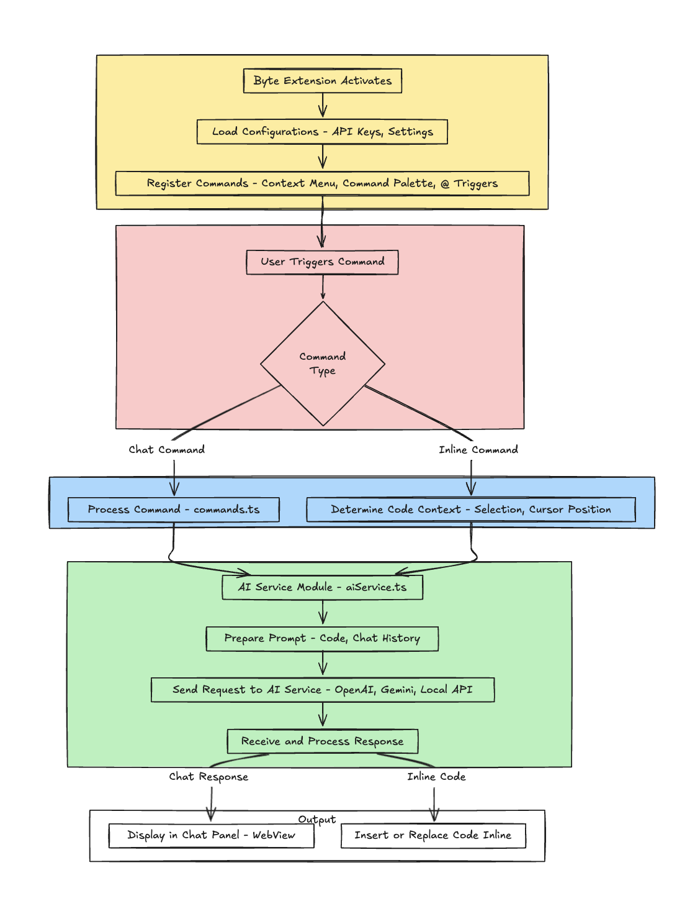

# Byte - AI Coding Assistant

Byte is a powerful Visual Studio Code extension that enhances your coding workflow with AI-powered assistance. It provides a chat interface and code analysis tools designed to help you write, understand, refactor, and optimize your code.

## Features

### Multi-Provider AI Integration
Byte supports different AI providers, allowing you to choose the one that best suits your needs:
- **OpenAI** - Utilize OpenAI's powerful language models
- **Google Gemini** - Leverage Google's advanced Gemini AI models
- **Local Models (Ollama)** - Connect to locally running AI models through Ollama on your own computer

### Intelligent Code Assistant
- **Code Analysis** - Get detailed explanations and analyses of your selected code blocks
- **Chat with Code** - Ask questions and get answers about your selected code blocks
- **Code Improvement** - Receive suggestions to improve your code quality
- **Documentation Generation** - Automatically generate comprehensive documentation
- **Code Optimization** - Optimize your code for performance, memory, or readability
- **Issue Detection** - Find potential bugs, security vulnerabilities, and code smells
- **Unit Test Generation** - Automatically create unit tests for your code

### Intuitive User Interface
- **Chat Panel** - Convenient chat interface in the sidebar
- **Code Analysis Panel** - Panel that analyzes selected code blocks and provides chat functionality
- **Context-Aware Responses** - AI understands your current file and project context

## Installation

1. Open the VS Code extensions panel (Ctrl+Shift+X / Cmd+Shift+X)
2. Search for "Byte AI Assistant"
3. Click Install

## Quick Start

1. Open the Byte panel by clicking the Byte icon in the activity bar
2. Configure your preferred AI provider by clicking the ⚙️ button
3. Start chatting with Byte!

## Code Analysis and Chat

There are two ways to analyze code and chat with Byte:

1. **Code Analysis**:
   - Select text and right-click
   - Choose "Analyze Code" from the "Byte AI Assistant" menu
   - The selected code will be analyzed and information will be provided

2. **Ask Question About Code**:
   - Select text and right-click
   - Choose "Ask Question About Code" from the "Byte AI Assistant" menu
   - Enter your question about the code and the AI will respond

## Keyboard Shortcuts

| Command | Shortcut (Windows/Linux) | Shortcut (Mac) |
|---------|--------------------------|----------------|
| Analyze Code | Ctrl+Alt+I | Cmd+Alt+I |
| Ask Question About Code | Ctrl+Alt+Q | Cmd+Alt+Q |

## Extension Settings

This extension provides the following settings:

* `byte.provider`: Set the default AI provider (openai, gemini, local)
* `byte.openai.apiKey`: Your OpenAI API key (stored securely)
* `byte.gemini.apiKey`: Your Google Gemini API key (stored securely)
* `byte.local.endpoint`: URL endpoint for your local AI model (default: http://localhost:11434/api/generate)
* `byte.local.model`: Model name to use in Ollama (default: llama3)

## Architecture

The extension follows a modular architecture:

1. **Extension Core** - Handles activation, command registration, and UI initialization
2. **AI Service** - Manages communication with AI providers and message history
3. **Chat Panel** - WebView-based UI for user interaction
4. **Command Manager** - Processes extension commands
5. **Inline Code Analysis** - Analyzes selected code blocks and provides chat functionality about the code

## Contributing

If you want to contribute to the project, please submit a Pull Request to the GitHub repository or open an Issue.

## License

This extension is licensed under the [MIT License](LICENSE).

## Privacy

Byte sends code snippets and queries to the configured AI provider. Please review the privacy policy of your chosen AI provider for details on how they handle your data.

**Enjoy using Byte AI Assistant!**
